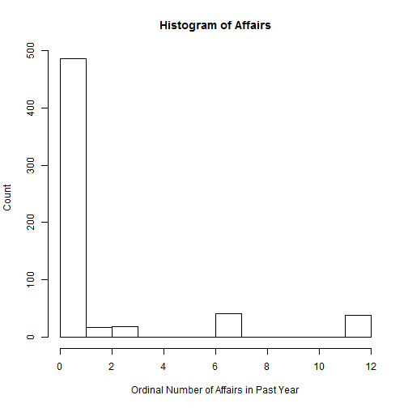
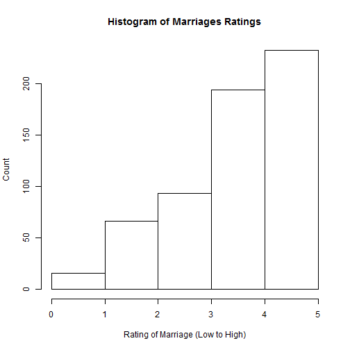
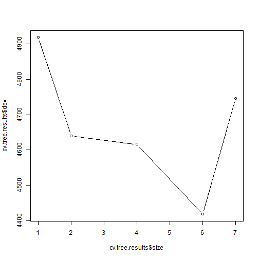
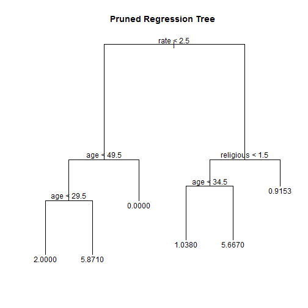
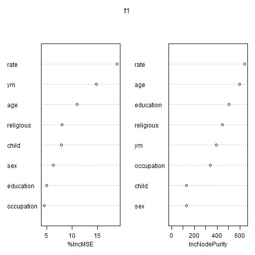
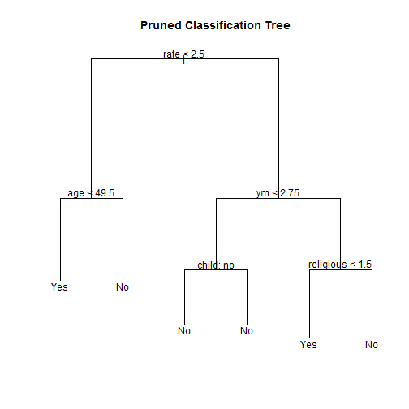
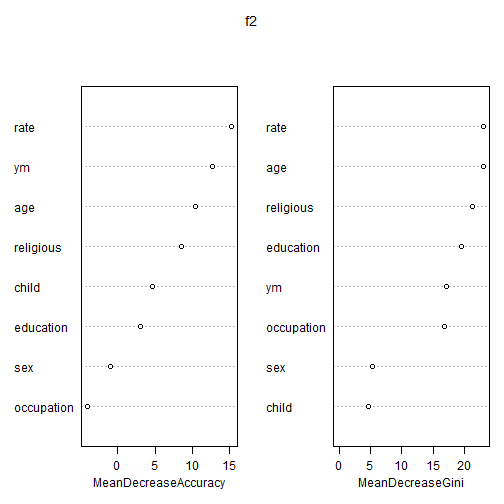

Predicting Extramarital Affairs
========================================================
author: Dean Young, Hans Trautlein, Laura Dallago
date: April 27, 2016
autosize: true


The Dataset
========================================================

- From Ray C. Fair's "A Theory of Extramarital Affairs," published in the *JPE* in 1978.
- From last late 60s questionnaire in Psychology Today, n = 601.
  - Sex (binary)
  - Age (continuous to ordinal)
  - Years Married (continuous to ordinal)
  - Has Children (binary)
  - Religiosity (Scale from 1-5, 5 being most religious)
  - Education (continuous to ordinal based on years of education)
  - Occupation (ordinal: higher level jobs = higher score)
  - Self Rating of Marriage (Scale from 1-5, 5 being most satisfied)
- Response = Number of Affairs In Past Year (continuous to ordinal: 0,1,2,3,7,12)

The Paper
========================================================

- Uses parametric Tobit model
- Based on censored distribution (Y $\geq$ 0 assumed)
- Four most important:
  - Marriage Rating (-)
  - Age (-)
  - Years Married (+)
  - Religiosity (-)

Looking at the Data, 1
========================================================

- Mostly no cheating
- Only 6 unique values



***

- Mostly satisfied
- Low very unsatisfied -> Low cheating



Binary Cheating Variable
========================================================


```r
b_Fair_train <- Fair_train %>% 
  mutate(had_affair = as.factor(ifelse(nbaffairs == 0, "No", "Yes"))) %>% 
  select(-nbaffairs)

b_Fair_test <- Fair_test %>% 
  mutate(had_affair = as.factor(ifelse(nbaffairs == 0, "No", "Yes"))) %>%
  select(-nbaffairs)
```

Baseline Models
========================================================

## Tobit (Regression)

- Same 4 significant variables (age weaker)
- Produces y* instead of E[y|x]
- Test MSE = 9.52


***

## Logistic (Classification)

- Also same 4 sig. variables (age weaker too)
- Test M.C. Rate = 23.8%
- Naive Model M.C. Rate = 24.5%


Pruned Regression Tree
========================================================

- 3 of 4 important variables, no years married
- Nuance in age
- Test MSE = 9.519 (barely beats Tobit)



Random Forest Regression
========================================================


***

- Same 4 important variables
- Nodal purity???
- Test MSE = 9.40

Pruned Classification Tree
========================================================



***

- 4/4 important variables
- Child?
- Very aggresive in detecting cheaters
- Test M.C. Rate = 27.8% (loses to both naive and logistic)


```
     
pred  No Yes
  No  98  26
  Yes 16  11
```

```
        
log_pred  No Yes
     No  108  30
     Yes   6   7
```

Random Forest Classification
========================================================



***
- 4/4 important variables
- Education?
- Much less aggresive
- Test M.C. Rate = 25.2% (still does no better than naive or logistic)


```
     
       No Yes
  No  106  30
  Yes   8   7
```

```
        
log_pred  No Yes
     No  108  30
     Yes   6   7
```

Weighted Missclassification Error, 1
========================================================


***

- False Positive $\neq$ False Negative
- Catching cheaters > validating faithfulness
- $$\frac{\sum_{i=1}^{N} w_{i}*IND(\hat{y_{i}} \neq y_{i})}{\sum_{i=1}^{N} w_{i}}$$
- Reweight with $w_{i}$ = 3 if $y_{i}$ = "Yes" and 1 otherwise

Weighted Missclassification Error, 2
========================================================

### Unweighted
1. Logistic
2. Naive
3. Random Forest
4. Pruned Tree

***

### Weighted
1. Pruned Tree
2. Logistic
3. Random Forest
4. Naive

Conclusions
========================================================
### Regression:
- Pruned tree, random forest model outperformed Tobit 

### Classification:
- Pruned tree, random forest model worse than naive
- Weighted misclassification error improved results greatly

### Overall:
- Rating of marriage clearly most important
- The compression of data is unfortunate

