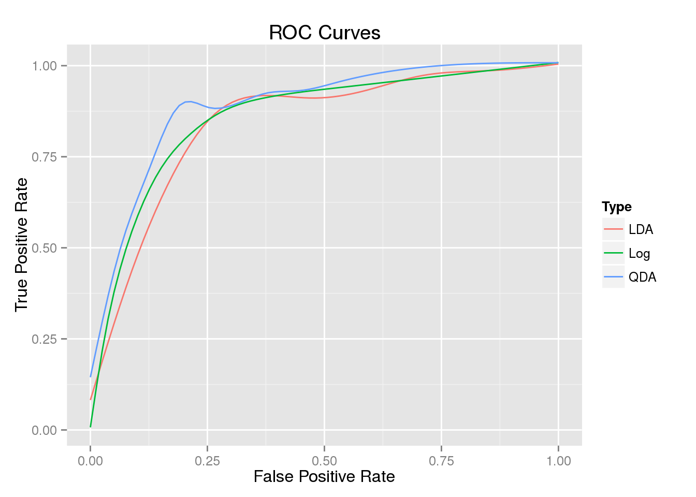

# Question 1

**Fit a logistic regression model for the start of civil war on all other variables except country and year (yes, this makes some questionable assumptions about independent observations); include a quadratic term for exports. Report the coefficients and their standard errors, together with R's p-values. Which ones does R say are significant at the 5% level?**


```r
m1 <- war %>% glm(data=.,start ~ schooling + growth + peace 
    + concentration + lnpop + fractionalization + dominance + exports + I(exports^2), family="binomial")
summary(m1)
```

```
## 
## Call:
## glm(formula = start ~ schooling + growth + peace + concentration + 
##     lnpop + fractionalization + dominance + exports + I(exports^2), 
##     family = "binomial", data = .)
## 
## Deviance Residuals: 
##     Min       1Q   Median       3Q      Max  
## -1.3655  -0.3627  -0.1893  -0.0932   3.3636  
## 
## Coefficients:
##                     Estimate Std. Error z value Pr(>|z|)    
## (Intercept)       -1.307e+01  2.795e+00  -4.677 2.91e-06 ***
## schooling         -3.156e-02  9.784e-03  -3.225 0.001259 ** 
## growth            -1.152e-01  4.307e-02  -2.675 0.007466 ** 
## peace             -3.713e-03  1.093e-03  -3.397 0.000681 ***
## concentration     -2.487e+00  1.005e+00  -2.474 0.013357 *  
## lnpop              7.677e-01  1.658e-01   4.632 3.63e-06 ***
## fractionalization -2.135e-04  9.102e-05  -2.345 0.019020 *  
## dominance          6.704e-01  3.535e-01   1.896 0.057920 .  
## exports            1.894e+01  5.865e+00   3.229 0.001243 ** 
## I(exports^2)      -2.944e+01  1.178e+01  -2.499 0.012449 *  
## ---
## Signif. codes:  0 '***' 0.001 '**' 0.01 '*' 0.05 '.' 0.1 ' ' 1
## 
## (Dispersion parameter for binomial family taken to be 1)
## 
##     Null deviance: 337.73  on 687  degrees of freedom
## Residual deviance: 256.42  on 678  degrees of freedom
## AIC: 276.42
## 
## Number of Fisher Scoring iterations: 7
```
See table above for coefficients, SEs, and p-values.
All but dominance are significant at the 5% level, although dominance is close: p = 0.058.

# Question 2
Interpretation: All parts of this question refer to the logistic regression model you just fit.

**What is the model's predicted probability for a civil war in India in the period beginning 1975? What probability would it predict for a country just like India in 1975, except that its male secondary school enrollment rate was 30 points higher? What probability would it predict for a country just like India in 1975, except that the ratio of commodity exports to GDP was 0.1 higher?**


```r
p_IN_75 <- war %>% filter(country=="India",year==1975) %>% predict(newdata=.,m1) %>% inv.logit() 
p_IN_ss <- war %>% filter(country=="India",year==1975) %>% mutate(schooling=schooling+30) %>% 
  predict(newdata=.,m1) %>% inv.logit()
p_IN_gdp <- war %>% filter(country=="India", year==1975) %>% mutate(exports=exports+0.1) %>%
  predict(newdata=.,m1) %>% inv.logit()
```
The predicted probability for a civil war in India beginning in 1975 is 0.3504199. For a country like India but with higher enrolment, we'd predict a probability of 0.17309. With higher exports, we'd predict 0.6961378.

**What is the model's predicted probability for a civil war in Nigeria in the period beginning 1965? What probability would it predict for a country just like Nigeria in 1965, except that its male secondary school enrollment rate was 30 points higher? What probability would it predict for a country just like Nigeria in 1965, except that the ratio of commodity exports to GDP was 0.1 higher?**

```r
p_NG_65 <- war %>% filter(country=="Nigeria",year==1965) %>% predict(newdata=.,m1) %>% inv.logit() 
p_NG_ss <- war %>% filter(country=="Nigeria",year==1965) %>% mutate(schooling=schooling+30) %>% 
  predict(newdata=.,m1) %>% inv.logit()
p_NG_gdp <- war %>% filter(country=="Nigeria", year==1965) %>% mutate(exports=exports+0.1) %>%
  predict(newdata=.,m1) %>% inv.logit()
```
The predicted probability for a civil war in Nigeria beginning in 1965 is 0.1709917. For a country like India but with higher enrolment, we'd predict a probability of 0.0741031. With higher exports, we'd predict 0.3310044.

**In the parts above, you changed the same predictor variables by the same amounts. If you did your calculations properly, the changes in predicted probabilities are not equal. Explain why not. (The reasons may or may not be the same for the two variables.)**

The different changes are due to the logistic regression: because the function does not have a constant slope, the response to change depends on where in the data the observations are. 

# Question 3
**Build a 2x2 confusion matrix (a.k.a. A classification tableor a contigency table) which counts: the number of outbreaks of civil war correctly predicted by the logistic regression; the number of civil wars not predicted by the model; the number of false predictions of civil wars; and the number of correctly predicted absences of civil wars. (Note that some entries in the table may be zero.)**


```r
my_log_pred <- ifelse(m1$fit < 0.5, "No", "Yes")
war$start <- ifelse(war$start==0,"No","Yes")
conf_log <- table(my_log_pred, war$start)
conf_log
```

```
##            
## my_log_pred  No Yes
##         No  637  43
##         Yes   5   3
```

**What fraction of the logistic regression's predictions are incorrect, i.e. what is the misclassification rate? (Note that this is if anything too kind to the model, since it's looking at predictions to the same training data set).**

The misclassification rate is 0.0697674.

**Consider a foolish (?) pundit who always predicts no war. What fraction of the pundit's predictions are correct on the whole data set? What fraction are correct on data points where the logistic regression model also makes a prediction?**

The foolish pundit would predict 0.0668605.

# Question 4
**Comparison: Since this is a classification problem with only two classes, we can compare Logistic Regression right along side Discriminant Analysis.**

**Fit an LDA model using the same predictors that you used for your logistic regression model. What is the training misclassification rate?**


```r
war$start <- as.factor(war$start)
m2 <- lda(start ~ schooling + growth + peace 
    + concentration + lnpop + fractionalization + dominance + exports + I(exports^2), data=war)

conf_lda <- table(predict(m2)$class, war$start)
conf_lda
```

```
##      
##        No Yes
##   No  636  40
##   Yes   6   6
```
The LDA has a misclassification rate of 0.0668605.

**Fit a QDA model using the very same predictors. What is the training misclassification rate?**


```r
m3 <- qda(start ~ schooling + growth + peace 
    + concentration + lnpop + fractionalization + dominance + exports + I(exports^2), data=war)
conf_qda <- table(predict(m3)$class, war$start)
conf_qda
```

```
##      
##        No Yes
##   No  618  26
##   Yes  24  20
```
The QDA has a misclassification rate of 0.0726744.

**How does the prediction accuracy of the three models compare? Why do you think this is?**

None of the three models does better than the naïve pundit. Of the three models, the QDA model has a higher misclassification rate but is more likely to predict war correctly (as a result of its less conservative estimates). This may be because the event is so rare and we don't have that many observations so it's hard to make predictions. Additionally, we're assuming that all our observations are independent but in fact they are highly correlated (countries over time).

#Challenge problem: 
**Using the code available in the slides titled qda.Rmd, construct an ROC curve for your logistic regression model. For an extra challenge, plot the ROC curves of all three models on the same plot.**


```
## geom_smooth: method="auto" and size of largest group is >=1000, so using gam with formula: y ~ s(x, bs = "cs"). Use 'method = x' to change the smoothing method.
```



In terms of ROC, it appears that QDA outperformed the LDA and Logistic regression models since it has the greatest area under the curve.
